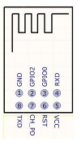
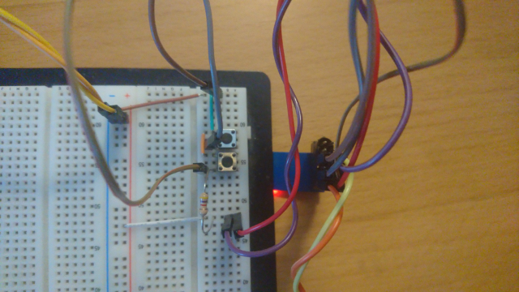
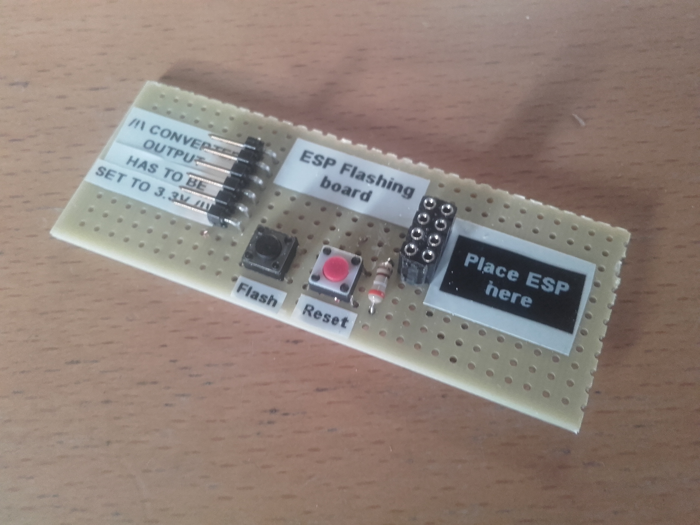

# Wiring Guide
Following you can find useful references for the hardware setup such as schematics and example breadboard wiring setups.

**ESP01 Pinout:**

**FTDI Wire Guide:**
- connect FTDI [cable](https://www.ftdichip.com/Products/Cables/USBTTLSerial.htm<Paste>)
    - black:GND, brown:CTS, red:VCC, orange:TXD, yellow:RXD, green:RTS

**Breadboard Wiring Guide:**

Note:
- 3.3v (red/purple)
- gnd (brown - rightmost)
- reset btn (brown centered)
- flash btn (gray)
Modes:
- normal operation (btns released)
- reset (left btn pressed)
- flash (both pressed, left (brown) released first then right (gray))

Example breadboard setup with two buttons:

And a more neat version produced by Robin Baran ([@RBinsonB](https://github.com/RBinsonB))

## Debug serial interface
- Connect ftdi cable with (vcc, gnd, ch_pd, tx(esp) -> rx(ftdi-yellow))
    - in terminal execute `sudo screen /dev/ttyUSB0 115200 8N1`

## Common Problems
- if device is busy use `lsof | grep /dev/ttyUSB0` (for `USB0`) and shutdown the occupying process
    - **Often QGroundControl is the culprit.**

## References
- Flash procedure wiring [instructions](http://www.whatimade.today/esp8266-easiest-way-to-program-so-far/)
- Official PX4 ESP8266 [documentation](https://docs.px4.io/v1.9.0/en/telemetry/esp8266_wifi_module.html)
- Configured to connect to a fixed hotspot (see section _Usage_)
- esp8266 runs on `/dev/ttyS0` on pixracer configuration with 20000 B/s (baudrate of 921600)
    - see `px/boards/px4/fmuv4/init/rc.board_mavlink`
- inspired from [dogmaphobic](https://github.com/dogmaphobic/mavesp8266)'s work.
- depends on [esp8266wifi](https://github.com/esp8266/Arduino/tree/master/libraries/ESP8266WiFi) ([Documentation](https://arduino-esp8266.readthedocs.io/en/latest/esp8266wifi/readme.html)).
    - e.g. [see IP class](https://github.com/esp8266/Arduino/blob/master/cores/esp8266/IPAddress.h)
    - e.g. [see WiFi header](https://github.com/espressif/arduino-esp32/blob/master/libraries/WiFi/src/ETH.h)
    - e.g. [see UDP driver](https://github.com/esp8266/Arduino/blob/master/libraries/ESP8266WiFi/src/WiFiUdp.h)

### Preparation of PX4
- flashing `px4_fmu-v4`
        - install `arm-none-eabi-gcc` [here](https://dev.px4.io/v1.9.0/en/setup/dev_env_linux_ubuntu.html#nuttx-based-hardware).
        - in this repository root execute `pip install -r requirements`
        - in px4 firmware folder `make px4_fmu-v4 upload`

### Connect to the Device
- connect via mavros ([installation instructions](https://github.com/mavlink/mavros/blob/master/mavros/README.md#installation))
    - `roslaunch mavros px4.launch fcu_url:=udp://:14550@192.168.3.14:14555`
    - test it with `rostopic echo /mavros/rc/in` (shows rc commands send to the aerial vehicle)

